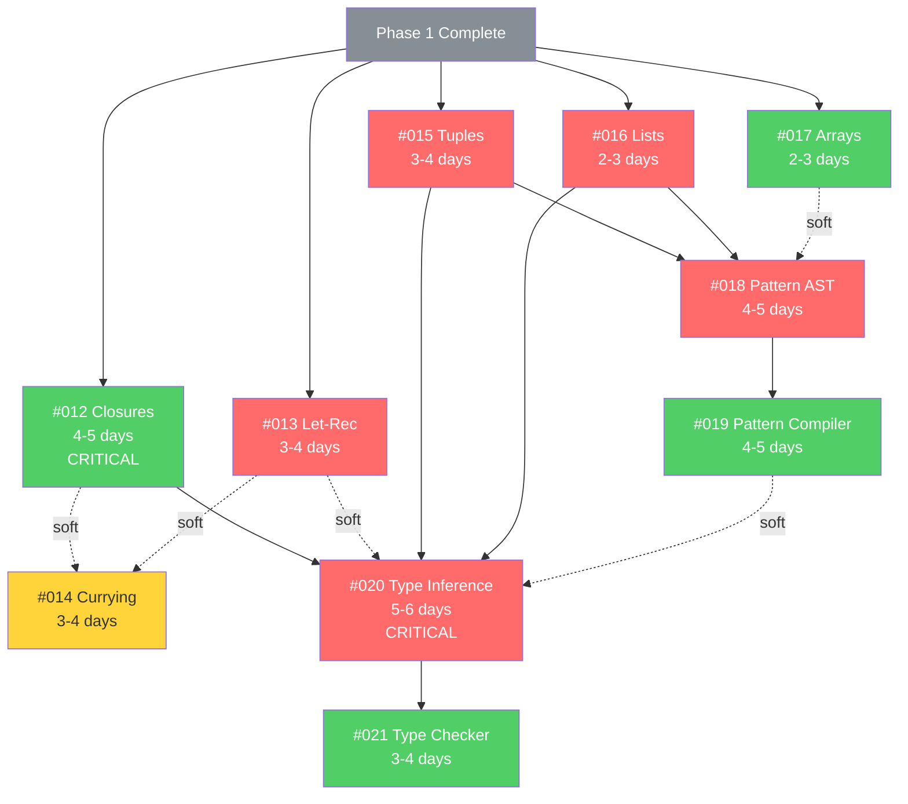
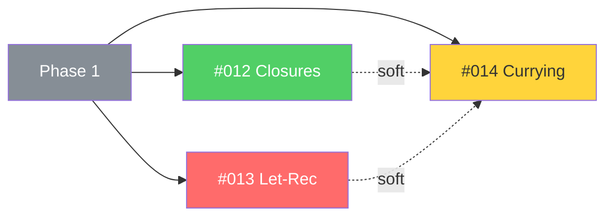
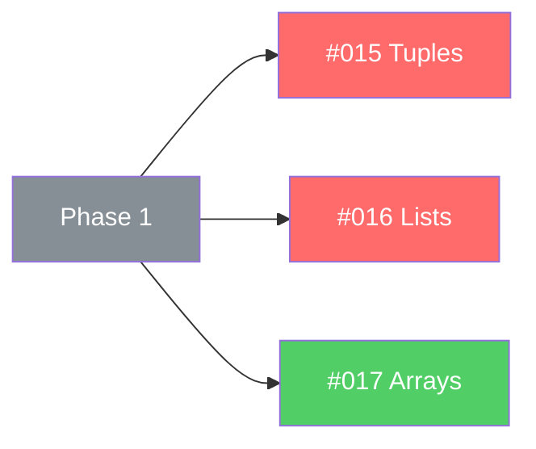
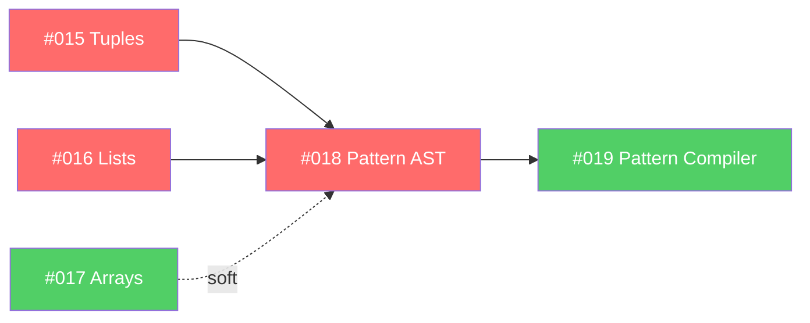
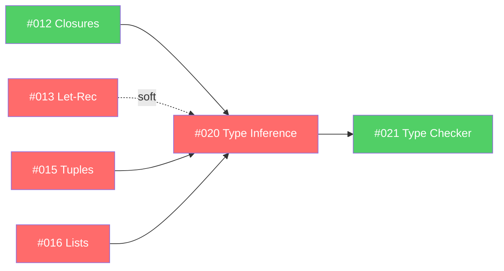

# FSRS Phase 2 Dependency Graph

Visual representation of issue dependencies and critical path for Phase 2: Language Features.

## Dependency Matrix

| Issue | Depends On | Blocks | Parallel Safe | Track |
|-------|-----------|---------|---------------|-------|
| #012 Closures | Phase 1 complete | #018, #019, #020 | ✅ Yes | VM |
| #013 Let-Rec | Phase 1 complete | #020 (soft) | ✅ Yes | Frontend |
| #014 Currying | #012 (soft), #013 (soft) | None | ⚠️ Coordinate | Integration |
| #015 Tuples | Phase 1 complete | #018, #020 | ✅ Yes | Frontend |
| #016 Lists | Phase 1 complete | #018, #020 | ✅ Yes | Frontend |
| #017 Arrays | Phase 1 complete | #018 (soft) | ✅ Yes | VM |
| #018 Pattern AST | #015, #016 | #019, #020 | ⚠️ Needs data | Frontend |
| #019 Pattern Compiler | #018 | #020 (soft) | ❌ Needs #018 | VM |
| #020 Type Inference | #012, #013, #015, #016 | #021 | ❌ CRITICAL | Frontend |
| #021 Type Checker | #020 | None | ❌ Needs #020 | VM |

## Dependency Graph



**Legend**:
- 🟢 Green: VM Track (Dev 2)
- 🔴 Red: Frontend Track (Dev 1)
- 🟡 Yellow: Integration Track (Dev 3)
- ⚫ Gray: Prerequisites (Phase 1)
- Solid arrows: Hard dependencies
- Dashed arrows: Soft dependencies

## Critical Path Analysis

### Critical Path (Longest Sequence)

```
Phase 1 → #012 Closures (5d) → #015 Tuples (4d) → #018 Pattern AST (5d) → #020 Type Inference (6d) → #021 Type Checker (4d) = 24 days + integration
```

**This is the minimum time to complete Phase 2** with perfect parallelization.

**With 3 developers**: ~28 days (4 weeks) accounting for coordination overhead.

### Parallel Paths

**Path 1 (Critical - Frontend/VM)**:
```
#012 (5d) → #015 (4d) → #018 (5d) → #020 (6d) → #021 (4d) = 24 days
```

**Path 2 (Frontend)**:
```
#013 (4d) → #016 (3d) = 7 days
```

**Path 3 (VM)**:
```
#017 (3d) = 3 days
```

**Path 4 (Integration)**:
```
#014 (4d) + Integration work = ongoing
```

### Bottleneck Analysis

**Bottleneck 1**: #012 (Closures) - Week 4
- Foundational for advanced features
- Blocks pattern matching and type inference indirectly
- 4-5 day implementation
- **Cannot be parallelized** (single complex feature)
- **Mitigation**: Start immediately, most experienced dev

**Bottleneck 2**: #020 (Type Inference) - Week 7
- Most complex issue in Phase 2
- Depends on closures, data structures, patterns
- 5-6 day implementation
- **Cannot be parallelized** (single complex algorithm)
- **Mitigation**: Research in Weeks 5-6, incremental implementation

**Bottleneck 3**: #018 + #019 Coordination - Week 6
- Pattern AST and compilation must align
- Requires cross-track coordination
- Both are 4-5 days
- **Can be parallelized with coordination**
- **Mitigation**: Interface-first development, daily syncs

## Milestone Dependencies

### Milestone 2.1: Functions & Closures (Week 4)
**Goal**: Closures, recursive functions, partial application

**Issues**: #012, #013, #014

**Dependencies**:
- Phase 1 complete (prerequisite)
- No internal dependencies between issues
- All can start simultaneously ✅

**Completion Criteria**:
- Closures capture variables correctly
- Let-rec enables recursion
- Currying works with closures
- Example: Recursive functions with closures

**Critical Path**: #012 (Closures) - 5 days

---

### Milestone 2.2: Data Structures (Week 5)
**Goal**: Tuples, lists, arrays working

**Issues**: #015, #016, #017

**Dependencies**:
- Phase 1 complete (prerequisite)
- No internal dependencies
- All can start simultaneously ✅

**Completion Criteria**:
- Tuple construction and destructuring
- List cons, head, tail operations
- Array indexing and updates
- Example: List processing pipeline

**Critical Path**: #015 (Tuples) - 4 days (feeds into #018)

---

### Milestone 2.3: Pattern Matching (Week 6)
**Goal**: Full pattern matching support

**Issues**: #018, #019

**Dependencies**:
- #015 (Tuples) - HARD
- #016 (Lists) - HARD
- #017 (Arrays) - SOFT
- **COORDINATED PARALLEL**: Define interface Day 1

**Completion Criteria**:
- Match expressions in AST/Parser
- Pattern compilation to bytecode
- Pattern matching over tuples, lists
- Example: Pattern-based list processing

**Critical Path**: #018 → #019 = 9 days (but can overlap with coordination)

---

### Milestone 2.4: Type System (Week 7)
**Goal**: Type inference and checking

**Issues**: #020, #021

**Dependencies**:
- #012 (Closures) - HARD
- #013 (Let-rec) - SOFT
- #015 (Tuples) - HARD
- #016 (Lists) - HARD
- #018 (Patterns) - SOFT
- #019 (Pattern Compiler) - SOFT

**Completion Criteria**:
- Hindley-Milner type inference working
- Polymorphic type support
- Type error messages clear
- Example: Polymorphic higher-order functions

**Critical Path**: #020 → #021 = 10 days (sequential)

---

## Work Order Recommendations

### Optimal Start Order (3 Developers)

### Week 4: Functions & Closures

**Day 1** (All hands - kickoff):
1. **Dev 1 (Frontend)**: Start #013 (Let-Rec) - PRIORITY
2. **Dev 2 (VM)**: Start #012 (Closures) - CRITICAL PATH
3. **Dev 3 (Integration)**: Start #014 (Currying) - coordinate with both

**Days 2-4**:
- All continue on their issues
- Daily sync on interfaces (closure API, let-rec syntax)
- Dev 3 coordinates between Dev 1 and Dev 2

**Day 5**:
- Integration testing
- Bug fixes
- Prepare for Week 5

---

### Week 5: Data Structures

**Day 1**:
1. **Dev 1**: Start #015 (Tuples)
2. **Dev 2**: Start #017 (Arrays)
3. **Dev 3**: Integration tests for Week 4 features

**Days 2-3**:
- Dev 1 continues #015
- Dev 2 finishes #017, supports Value enum changes
- Dev 3 creates example scripts

**Days 4-5**:
- Dev 1 starts #016 (Lists)
- Dev 2 supports data structure integration
- Dev 3 performance benchmarks

**Day 6**:
- Integration and documentation
- Prepare for Week 6 (pattern matching coordination session)

---

### Week 6: Pattern Matching

**Day 1** (Coordination Day):
- **Morning**: All-hands design session for pattern AST interface
- **Afternoon**:
  - Dev 1 starts #018 (Pattern AST)
  - Dev 2 starts #019 (Pattern Compiler) with agreed interface
  - Dev 3 prepares integration tests

**Days 2-3**:
- Parallel development with agreed interface
- Mid-day check-ins

**Day 4**:
- Integration checkpoint
- Adjust interfaces if needed

**Day 5**:
- Final integration
- Testing and bug fixes

---

### Week 7: Type System

**Day 1**:
- **Dev 1**: Start #020 (Type Inference) - CRITICAL
- **Dev 2**: Prepare for #021, review type inference design
- **Dev 3**: Integration testing for Weeks 4-6

**Days 2-3**:
- Dev 1 continues #020 (inference engine)
- Dev 2 helps with testing, prepares #021
- Dev 3 creates type system examples

**Day 4**:
- Dev 1 finishes #020, shares inference API
- Dev 2 starts #021 (Type Checker)
- Dev 3 integration testing

**Days 5-6**:
- Dev 1 supports #021 integration
- Dev 2 finishes #021
- Dev 3 final integration testing

**Day 7 (if needed)**:
- Polish and bug fixes
- Phase 2 completion validation

---

## Dependency Resolution Checklist

### Before Starting Each Issue

**#012 (Closures)**:
- [ ] Phase 1 MVP complete (all tests passing)
- [ ] Understand closure upvalue mechanisms
- [ ] Design closure value representation
- [ ] No dependencies - Can start immediately

**#013 (Let-Rec)**:
- [ ] Phase 1 MVP complete
- [ ] AST and parser infrastructure from Phase 1
- [ ] No dependencies - Can start immediately

**#014 (Currying)**:
- [ ] Phase 1 MVP complete
- [ ] Coordinate with #012 (closure API)
- [ ] Coordinate with #013 (function binding syntax)
- [ ] Soft dependencies - Can start with mocks

**#015 (Tuples)**:
- [ ] Phase 1 MVP complete
- [ ] Value representation extensible
- [ ] No dependencies - Can start immediately

**#016 (Lists)**:
- [ ] Phase 1 MVP complete
- [ ] Can parallel with #015
- [ ] No dependencies - Can start immediately

**#017 (Arrays)**:
- [ ] Phase 1 MVP complete
- [ ] VM value system supports extensions
- [ ] No dependencies - Can start immediately

**#018 (Pattern AST)**:
- [ ] #015 (Tuples) merged - HARD
- [ ] #016 (Lists) merged - HARD
- [ ] Can import tuple and list AST nodes
- [ ] Coordinate with #019 on pattern IR

**#019 (Pattern Compiler)**:
- [ ] #018 (Pattern AST) interface defined - HARD
- [ ] Pattern AST types available
- [ ] Can consume pattern nodes for compilation

**#020 (Type Inference)**:
- [ ] #012 (Closures) merged - HARD
- [ ] #015 (Tuples) merged - HARD
- [ ] #016 (Lists) merged - HARD
- [ ] All value types have type representations
- [ ] Hindley-Milner algorithm researched

**#021 (Type Checker)**:
- [ ] #020 (Type Inference) merged - HARD
- [ ] Inference engine API available
- [ ] Can invoke type inference

---

## Unblocking Strategies

### If #012 (Closures) is Delayed
**Impact**: HIGH - Delays type inference (#020) and advanced features

**Mitigation**:
1. **Escalate immediately** - All hands on deck by Day 3
2. **Simplify**: Implement basic closures first, optimize later
3. **Reference implementations**: Use OCaml/Lua closure patterns
4. **Pair programming**: VM specialist + Frontend specialist
5. **Defer optimization**: Get it working, optimize in Phase 3

**Workaround**:
- Continue with data structures (#015-#017) in Week 5
- Pattern matching can proceed without closures
- Type inference delayed but not blocked entirely

---

### If #015 or #016 (Data Structures) Delayed
**Impact**: MEDIUM - Delays pattern matching (#018)

**Mitigation**:
1. Implement incrementally (tuples first, then lists)
2. Pattern matching can start with basic data structures
3. Add array patterns later if #017 delayed

**Workaround**:
- Pattern matching can start with simpler patterns
- Defer complex tuple/list patterns to later

---

### If #018/# 019 Coordination Fails
**Impact**: MEDIUM - Week 6 integration issues

**Mitigation**:
1. **Day 1 alignment session** - mandatory
2. Use intermediate representation for patterns
3. Mock pattern compiler while AST finalized
4. Integration checkpoint Day 3 (mandatory)

**Workaround**:
- Dev 3 becomes integration bridge
- All-hands debug session if needed
- Extend Week 6 by 1-2 days if critical

---

### If #020 (Type Inference) is Delayed
**Impact**: CRITICAL - Blocks Phase 2 completion

**Mitigation**:
1. **Research in advance** (Weeks 5-6)
2. **Reference implementations**: miniml, languages
3. **Incremental implementation**:
   - Simple types first (int, bool, string)
   - Then function types
   - Then polymorphism
   - Finally let-polymorphism
4. **Pair programming**: Frontend + Integration specialists
5. **Defer scope**: Polymorphism can be simplified

**Workaround**:
- Type checker (#021) can start with simple types
- Polymorphism deferred to Phase 3 if needed
- Still valuable without full polymorphism

---

## Dependency Graph by Week

### Week 4 Dependencies



**Blocking Issues**: None (all can start)
**Parallel Issues**: All 3 issues fully parallel
**Coordination**: #014 coordinates with #012 and #013

---

### Week 5 Dependencies



**Blocking Issues**: None
**Parallel Issues**: All 3 issues fully parallel
**Coordination**: Value enum extensions (minimal)

---

### Week 6 Dependencies



**Blocking Issues**: #015, #016 must complete first
**Parallel Issues**: #018 and #019 (with coordination)
**Coordination**: High (interface-first development)

---

### Week 7 Dependencies



**Blocking Issues**: Multiple (#012, #015, #016 for #020)
**Sequential Issues**: #020 → #021 (cannot parallel)
**Coordination**: Moderate (type inference API for #021)

---

**Total Issues**: 10
**Critical Path**: 24 days (minimum)
**Parallel Duration**: 28 days (4 weeks with 3 devs)
**Parallel Speedup**: 1.75x
**Coordination Overhead**: ~15% (daily syncs, integration)
