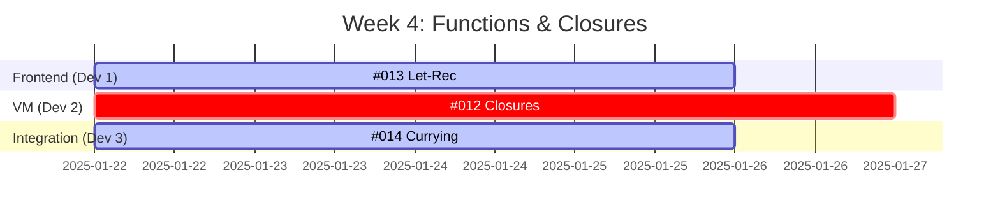
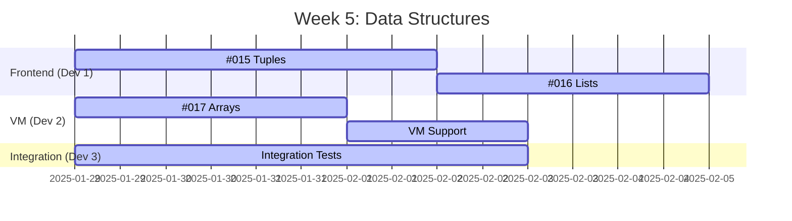
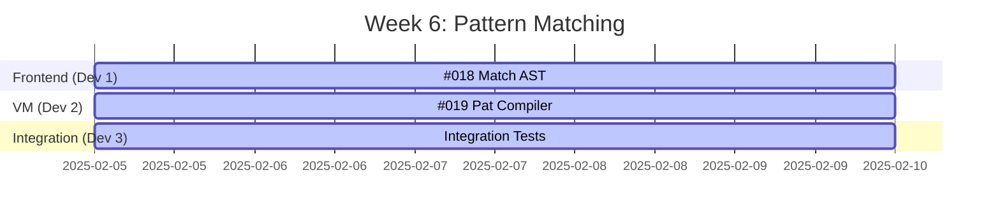
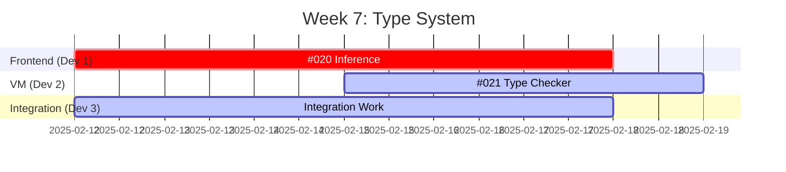

# FSRS Phase 2 Parallelization Guide

Comprehensive guide for maximizing parallel development throughput during Phase 2: Language Features (Weeks 4-7).

## Overview

Out of 10 total issues, **8 can be worked on in parallel** across different weeks. This enables a 3-developer team to complete Phase 2 in 4 weeks instead of 10+ weeks sequential development.

## Parallel Work Philosophy

### Safe to Parallelize When:
- Issues modify different components (Frontend vs VM vs Integration)
- Issues work on independent features
- Clear interface contracts between components
- Explicit `parallel-safe` label

### NOT Safe to Parallelize When:
- Issues modify same files simultaneously
- Hard dependencies between issues
- Requires tight coordination between tracks

## Team Structure (3 Developers)

### Developer 1: Frontend Specialist
**Focus**: AST, Parser, Type System

**Week 4** (Functions & Closures):
- Days 1-4: #013 (Let-Rec Bindings) - 3-4 days
- Support: Review #012 (Closures), coordinate on AST changes

**Week 5** (Data Structures):
- Days 1-4: #015 (Tuple Support) - 3-4 days
- Days 4-6: #016 (List Support) - 2-3 days

**Week 6** (Pattern Matching):
- Days 1-5: #018 (Pattern Matching AST) - 4-5 days
- Coordinate with Dev 2 on pattern compilation

**Week 7** (Type System):
- Days 1-6: #020 (Type Inference) - 5-6 days - **CRITICAL PATH**

**Skills**: Type theory, parser design, AST transformations, Hindley-Milner algorithm

**Files Owned**:
- `fsrs-frontend/src/ast.rs`
- `fsrs-frontend/src/parser.rs`
- `fsrs-frontend/src/types.rs` (new)
- `fsrs-frontend/src/inference.rs` (new)

---

### Developer 2: VM Specialist
**Focus**: Runtime, Bytecode, Value System

**Week 4** (Functions & Closures):
- Days 1-5: #012 (Closure Support) - 4-5 days - **CRITICAL PATH**

**Week 5** (Data Structures):
- Days 1-3: #017 (Array Support) - 2-3 days
- Days 3-5: Support #015, #016 with VM changes
- Integration work

**Week 6** (Pattern Matching):
- Days 1-5: #019 (Pattern Compiler) - 4-5 days
- Coordinate with Dev 1 on pattern AST

**Week 7** (Type System):
- Days 1-4: #021 (Type Checker) - 3-4 days
- Depends on #020 completion
- Integration testing

**Skills**: VM implementation, bytecode design, closure mechanisms, runtime optimization

**Files Owned**:
- `fsrs-vm/src/value.rs`
- `fsrs-vm/src/bytecode.rs`
- `fsrs-vm/src/vm.rs`
- `fsrs-vm/src/closure.rs` (new)
- `fsrs-vm/src/gc.rs` (new, if needed)

---

### Developer 3: Integration & Quality Engineer
**Focus**: Currying, Integration, Testing, Examples

**Week 4** (Functions & Closures):
- Days 1-4: #014 (Currying & Partial Application) - 3-4 days
- Integration testing for closures

**Week 5** (Data Structures):
- Integration tests for tuples, lists, arrays
- Example scripts demonstrating features
- Performance benchmarks
- Documentation updates

**Week 6** (Pattern Matching):
- Integration tests for pattern matching
- End-to-end example scripts
- Error handling tests
- Documentation

**Week 7** (Type System):
- Integration tests for type inference
- Type error message testing
- End-to-end validation
- Phase 2 documentation
- Release preparation

**Skills**: Integration testing, test design, documentation, debugging, performance analysis

**Files Owned**:
- `fsrs-frontend/src/compiler.rs` (shared with Dev 1)
- `fsrs-demo/src/main.rs`
- `tests/integration/*.rs`
- `examples/*.fsrs`
- `docs/examples/*.md`

---

## Week-by-Week Parallel Execution

### Week 4: Functions & Closures (100% PARALLEL)



**Parallel Tracks**: 3/3 issues parallel
- **Track A (Frontend)**: #013 Let-Rec Bindings
- **Track B (VM)**: #012 Closure Support (CRITICAL)
- **Track C (Integration)**: #014 Currying

**File Conflicts**: NONE
- Dev 1: `ast.rs`, `parser.rs`
- Dev 2: `value.rs`, `vm.rs`, `closure.rs`
- Dev 3: `compiler.rs`, integration tests

**Dependencies**:
- All three can start simultaneously
- #014 may need coordination with #012 and #013 mid-week
- Daily sync recommended

**Deliverables**:
- Closures with proper upvalue capture
- Recursive function bindings (let-rec)
- Currying and partial application
- 40+ new tests

---

### Week 5: Data Structures (100% PARALLEL)



**Parallel Tracks**: 3/3 issues parallel
- **Track A (Frontend)**: #015 Tuples → #016 Lists
- **Track B (VM)**: #017 Arrays + support work
- **Track C (Integration)**: Testing and examples

**File Conflicts**: MINIMAL
- Shared: `value.rs` (add new Value variants)
- Coordination: Daily updates on Value enum changes
- Strategy: Dev 1 adds Tuple/List variants, Dev 2 adds Array variant

**Dependencies**:
- All independent data structures
- Coordination on Value enum extensions
- Integration tests use all three

**Deliverables**:
- Tuple construction and destructuring
- List operations (cons, head, tail)
- Array indexing and updates
- 50+ new tests

---

### Week 6: Pattern Matching (COORDINATED PARALLEL)



**Parallel Tracks**: 2/2 issues parallel (plus integration)
- **Track A (Frontend)**: #018 Pattern Matching (AST/Parser)
- **Track B (VM)**: #019 Pattern Compiler (Bytecode)
- **Track C (Integration)**: Testing and examples

**File Conflicts**: MODERATE
- Shared interfaces: Pattern AST → Bytecode
- Coordination: Define pattern IR mid-week
- Strategy: Dev 1 defines AST, Dev 2 consumes it

**Dependencies**:
- #019 needs #018's pattern AST (define early)
- Use interface-first development
- Mid-week integration checkpoint

**Deliverables**:
- Match expressions in AST/Parser
- Pattern compilation to decision trees
- Full pattern matching support
- 40+ new tests

**Coordination Protocol**:
1. **Day 1**: Dev 1 defines pattern AST, shares with Dev 2
2. **Day 2-3**: Parallel development with agreed interface
3. **Day 4**: Integration checkpoint, adjust if needed
4. **Day 5**: Final integration and testing

---

### Week 7: Type System (SEQUENTIAL with PARALLEL INTEGRATION)



**Parallel Tracks**: Limited (type inference is critical path)
- **Track A (Frontend)**: #020 Type Inference (CRITICAL - 6 days)
- **Track B (VM)**: #021 Type Checker (starts Day 3-4)
- **Track C (Integration)**: Full week of integration work

**File Conflicts**: LOW
- #020: `types.rs`, `inference.rs` (new files)
- #021: `checker.rs`, compiler integration
- Minimal overlap

**Dependencies**:
- #021 depends on #020 (needs type inference engine)
- #020 needs closures + data structures from Weeks 4-5
- Integration can parallel throughout

**Deliverables**:
- Hindley-Milner type inference
- Type checking and validation
- Polymorphic type support
- Type error messages
- Phase 2 complete
- 60+ new tests

**Coordination Protocol**:
1. **Days 1-3**: Dev 1 focuses on inference, Dev 3 on integration
2. **Day 3**: Share inference engine interface
3. **Days 4-6**: Dev 2 implements type checker using inference
4. **Day 6**: Final integration, all features working together

---

## Parallelization Efficiency Matrix

| Week | Issues | Parallel | Sequential | Speedup | Utilization |
|------|--------|----------|------------|---------|-------------|
| Week 4 | 3 | 5 days | 11 days | 2.2x | 100% |
| Week 5 | 3 | 6 days | 9 days | 1.5x | 100% |
| Week 6 | 2 | 5 days | 9 days | 1.8x | 100% |
| Week 7 | 2 | 6 days | 9 days | 1.5x | 90% |
| **Total** | **10** | **~4 weeks** | **~7 weeks** | **1.75x** | **97%** |

## Merge Conflict Prevention

### Directory-Based Ownership

| Developer | Primary Directories | Secondary Directories |
|-----------|--------------------|-----------------------|
| **Frontend Dev** | `fsrs-frontend/src/` (ast, parser, types, inference) | `fsrs-frontend/src/compiler.rs` (shared) |
| **VM Dev** | `fsrs-vm/src/` (value, bytecode, vm, closure) | - |
| **Integration Dev** | `fsrs-demo/src/`, `tests/`, `examples/` | `fsrs-frontend/src/compiler.rs` (shared) |

### Shared Files Protocol

**Potentially Shared Files**:
- `fsrs-vm/src/value.rs` - Value enum (Week 5 data structures)
- `fsrs-frontend/src/compiler.rs` - Compiler (multiple weeks)
- `fsrs-frontend/src/ast.rs` - AST extensions

**Conflict Prevention**:
1. **Interface-First**: Define interfaces before implementation
2. **Small, Focused Commits**: Commit frequently, small changes
3. **Communication**: Slack/Discord for real-time coordination
4. **Daily Syncs**: 15-min standup to flag file usage
5. **PR Early**: Open draft PRs to show WIP

### Git Branch Strategy

```
main
├─ feat/issue-012-closure-support          (Dev 2)
├─ feat/issue-013-let-rec                  (Dev 1)
├─ feat/issue-014-currying                 (Dev 3)
├─ feat/issue-015-tuple-support            (Dev 1)
├─ feat/issue-016-list-support             (Dev 1)
├─ feat/issue-017-array-support            (Dev 2)
├─ feat/issue-018-pattern-matching         (Dev 1)
├─ feat/issue-019-pattern-compiler         (Dev 2)
├─ feat/issue-020-type-inference           (Dev 1)
└─ feat/issue-021-type-checker             (Dev 2)
```

**Merge Strategy**:
1. Rebase on main before merging
2. Squash merge to keep history clean
3. Delete branch after merge
4. Tag milestones: `v0.2.0-m2.1`, `v0.2.0-m2.2`, etc.

### Daily Coordination Protocol

**Morning Standup (15 min)**:
- What you completed yesterday
- What you're working on today
- Which files you'll touch today
- Any blockers or coordination needs

**Mid-Day Check-In** (Week 6 only):
- Pattern matching interface alignment
- Quick status update

**End-of-Day**:
- Push WIP commits
- Update PR status and description
- Flag any upcoming conflicts for tomorrow

## Risk Mitigation

### Risk: Closure Implementation Delays (#012)
**Impact**: HIGH - Blocks pattern matching and type inference

**Prevention**:
- Most experienced VM developer on #012
- Start Week 4 with closure design session
- Use well-known closure implementation patterns
- Reference OCaml, Lua, Python closure mechanisms

**Response**:
- All-hands pair programming if delayed
- Simplify closure implementation (defer optimizations)
- Escalate to team lead by Day 3 if stuck

---

### Risk: Type Inference Complexity (#020)
**Impact**: CRITICAL - Blocks Week 7 completion

**Prevention**:
- Research Hindley-Milner in Week 5-6
- Reference existing implementations (miniml, etc.)
- Implement incrementally (simple types first)
- Extensive unit tests for inference

**Response**:
- Defer polymorphism if needed (keep simple types working)
- Pair programming with frontend specialist
- Consider reducing scope (no let-polymorphism initially)

---

### Risk: Pattern Matching Coordination (#018 + #019)
**Impact**: MEDIUM - Week 6 integration issues

**Prevention**:
- Interface-first development (Day 1 alignment)
- Daily check-ins during Week 6
- Use intermediate representation for patterns
- Mock interfaces for parallel development

**Response**:
- Integration session mid-week
- Adjust interfaces if needed
- Dev 3 helps with integration debugging

---

### Risk: Value Enum Conflicts (Week 5)
**Impact**: LOW - Merge conflicts on `value.rs`

**Prevention**:
- Coordinate on Value variant additions
- One developer adds all new variants (Dev 1)
- Others use the new variants after merge

**Response**:
- Quick communication on Slack
- Rebase and resolve conflicts immediately
- Small commits make conflicts easier

---

## TDD Workflow

### Test-Driven Development (All Issues)

1. **Red**: Write failing test first
   ```rust
   #[test]
   fn test_closure_captures_variable() {
       let code = "let x = 10 in (fun y -> x + y)";
       let result = compile_and_run(code);
       // Test fails - closures not implemented
   }
   ```

2. **Green**: Implement minimum code to pass
   ```rust
   pub enum Value {
       Closure(Gc<Closure>), // Add closure variant
       // ...
   }
   ```

3. **Refactor**: Improve implementation
   ```rust
   // Optimize closure representation
   // Add upvalue caching
   // Improve GC handling
   ```

4. **Repeat**: Next test case

### PR Checklist (Before Review)
- [ ] All tests pass: `just test`
- [ ] No clippy warnings: `just lint`
- [ ] Code formatted: `just fmt`
- [ ] New tests added for new functionality
- [ ] Documentation updated (API docs, examples)
- [ ] Rebase on main (no conflicts)
- [ ] Cross-track coordination if shared files modified

## Communication Channels

### Recommended Setup

**GitHub**:
- Issues: Task tracking with dependencies
- PRs: Code review and discussion
- Discussions: Design decisions, architecture

**Slack/Discord** (if available):
- `#fsrs-phase2` - General Phase 2 discussion
- `#fsrs-frontend` - Frontend track (Dev 1)
- `#fsrs-vm` - VM track (Dev 2)
- `#fsrs-standup` - Daily standup updates
- `#fsrs-blockers` - Urgent coordination

### PR Review Protocol

**Priority Levels**:
1. **Critical** (#012, #020) - Review within 4 hours
2. **High** (#013, #018, #019) - Review within 8 hours
3. **Normal** - Review within 24 hours

**Reviewer Assignment**:
- Frontend PRs: VM dev + Integration dev review
- VM PRs: Frontend dev + Integration dev review
- Integration PRs: All team members review
- Cross-track PRs: Mandatory reviews from affected tracks

**Review Focus**:
- Interface contracts maintained
- Tests comprehensive
- No performance regressions
- Documentation clear

## Success Metrics

### Parallelization Efficiency
```
Efficiency = (Parallel Duration) / (Sequential Duration)
Target: < 60%
```

**Phase 2 Target**:
- Sequential: ~7 weeks
- Parallel (3 devs): ~4 weeks
- Efficiency: 57% ✅

### Merge Conflict Rate
```
Conflict Rate = (PRs with conflicts) / (Total PRs)
Target: < 10%
```

**Expected**:
- 10 PRs total
- 1-2 conflicts expected (Value enum, compiler.rs)
- Rate: 10-20% (acceptable)

### Integration Success Rate
```
Integration Rate = (Features working end-to-end) / (Total features)
Target: 100%
```

**Checkpoints**:
- End of Week 4: Closures + Let-rec + Currying working together
- End of Week 5: Data structures interoperable
- End of Week 6: Pattern matching over all data structures
- End of Week 7: Type inference for all features

### Code Review Latency
```
Review Latency = Time from "ready for review" to first review
Target: < 12 hours
```

## Phase 2 Completion Checklist

### Week 4 Deliverables
- [ ] #012: Closures implemented and tested
- [ ] #013: Let-rec bindings working
- [ ] #014: Currying and partial application
- [ ] Example: Recursive factorial with closures
- [ ] 40+ new tests

### Week 5 Deliverables
- [ ] #015: Tuples working (construction, destructuring)
- [ ] #016: Lists working (cons, operations)
- [ ] #017: Arrays working (indexing, updates)
- [ ] Example: List processing with map/filter
- [ ] 50+ new tests

### Week 6 Deliverables
- [ ] #018: Pattern matching AST and parser
- [ ] #019: Pattern compilation to bytecode
- [ ] Example: Pattern matching over lists, tuples
- [ ] 40+ new tests

### Week 7 Deliverables
- [ ] #020: Type inference engine complete
- [ ] #021: Type checker integrated
- [ ] Example: Polymorphic functions with inference
- [ ] Type error messages clear and helpful
- [ ] 60+ new tests
- [ ] **Phase 2 COMPLETE**: 150+ total tests

---

**Total Parallelization Capacity**: 8/10 issues (80%)
**Recommended Team Size**: 3 developers
**Estimated Speedup**: 1.75x vs sequential
**Expected Duration**: 4 weeks (Weeks 4-7)
**Team Utilization**: 97% average across all weeks
